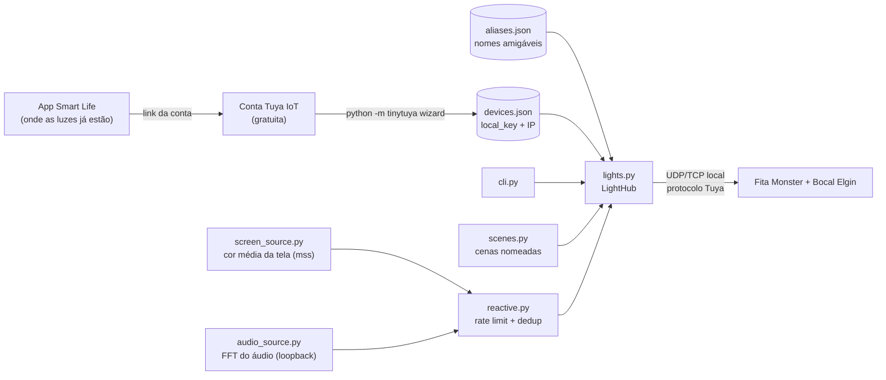

# rgb-hub

Parte 2 da série "projetos de garagem (de quarto)" — [parte 1 foi o carro](https://github.com/leonardobora/ka-obd-lab).

Central de automação via terminal pras luzes RGB (fita LED Monster Smart +
lâmpada bocal Elgin). As duas rodam no ecossistema Tuya (app Smart
Life/Tuya Smart por trás), então dá pra controlar as duas com a mesma
lib — em modo **local** (rede, sem depender da nuvem da Tuya depois do
setup inicial), o que importa pra reação em tempo real (ex: mudar cor
durante um jogo, sem esperar round-trip de nuvem).

## Arquitetura



Setup já validado com as luzes reais (`Bedroom`/Elgin e `MONITOR`/Monster,
via `aliases.json` como `quarto` e `fita`).

## Por que não dá pra validar com mock (diferente do projeto do carro)

O ELM327 fala um protocolo de texto simples (comandos AT), fácil de
simular. O protocolo Tuya usa criptografia própria por dispositivo
(`local_key`), então não tem como fingir um dispositivo de forma
realista sem primeiro ter uma chave real gerada pelo setup oficial. A
validação de verdade só acontece depois do passo manual abaixo.

## Setup (passo manual, só você consegue fazer — precisa de login)

1. Crie uma conta grátis em [iot.tuya.com](https://iot.tuya.com), crie um
   "Cloud Project" (qualquer nome, região que bater com seu país —
   normalmente "Western America" ou "Central Europe" cobrem o Brasil,
   teste as duas se uma não achar os dispositivos).
2. Dentro do projeto, na aba de vincular app, escaneie o QR code pelo
   app **Smart Life** (Perfil → Configurações → vincular projeto de
   terceiros) pra linkar sua conta que já tem a fita e a lâmpada
   cadastradas.
3. Anote o **Access ID/Client ID** e o **Access Secret** do projeto.
4. Instale as dependências e rode o wizard, que gera `devices.json`
   com IP + local_key de cada dispositivo:

   ```
   pip install -r requirements.txt
   python -m tinytuya wizard
   ```

   Ele vai pedir o Client ID/Secret e a região. No final gera
   `devices.json` na pasta atual — copie ele pra dentro de `rgb-hub/`.

5. Copie `aliases.example.json` pra `aliases.json` e troque os
   `SEU_DEVICE_ID_AQUI` pelos `id` reais que aparecerem no
   `devices.json` (facilita chamar as luzes pelo nome ao invés do ID).

`devices.json` e `aliases.json` **nunca vão pro git** — já estão no
`.gitignore`. O `local_key` dá controle total do dispositivo pra quem
tiver acesso a ele.

## Uso

```
python cli.py list
python cli.py on fita
python cli.py color fita FF00FF
python cli.py brightness quarto 60
python cli.py scene gaming

# modo dinamico -- roda em loop ate Ctrl+C
python cli.py sync screen                       # todas as luzes seguem a cor media da tela
python cli.py sync screen --lights fita          # so a fita
python cli.py sync audio                         # todas seguem o audio que esta tocando (loopback)
python cli.py sync audio --lights quarto --gain 12   # aumenta sensibilidade se ficar fraco
```

`sync audio` escuta o que está saindo pelo alto-falante padrão (loopback,
via `soundcard`), não o microfone — funciona com música, jogo, qualquer
áudio do sistema. Separa em 3 faixas (grave/médio/agudo) via FFT e mapeia
pra R/G/B. Se a resposta ficar fraca ou saturada, ajuste `--gain`.

Detecção de batida vem ligada por padrão: reaproveita o mesmo FFT (não
adiciona custo de CPU relevante), mantém uma média móvel da energia do
grave e dá um flash de brilho quando o grave atual estoura acima dessa
média. Ajuste com `--beat-sensitivity` (mais alto = menos batidas
detectadas, só as mais fortes) ou desligue com `--no-beat` pra manter
só a cor contínua.

Se as luzes não responderem, o motivo mais comum é a versão do
protocolo Tuya errada — `lights.py` assume `3.3`, mas alguns aparelhos
usam `3.1` ou `3.4`. Ajuste o parâmetro `version` em `LightHub()` se
precisar.

### Performance do modo `sync`

`sync screen` captura a tela periodicamente — capturar rápido demais
(30fps+) deixa o processo comendo ~100% de um núcleo. O padrão atual
(`fps=8`) mede ~9% de CPU / ~74MB de RAM em uso contínuo, mesmo com
conteúdo dinâmico na tela (testado com vídeo de luzes piscando rápido).
Se sentir o PC pesar, baixe ainda mais via `screen_colors(fps=...)`.

A cor também não é mais a média crua de RGB (que tende pra
cinza/lilás/branco em telas com conteúdo misto) — é a cor dominante
extraída em HSV, ignorando pixels sem saturação (fundo preto, texto
branco) e com boost de saturação, então fica mais fiel ao que a tela
"parece" ter de cor.

### Ícone na bandeja (toggle sem terminal aberto)

```
python tray.py
```

Sobe um ícone no system tray do Windows (perto do relógio, pode estar
atrás da setinha `^` na primeira vez). Clique direito abre o menu:
liga/desliga **Sync Tela**, liga/desliga **Sync Áudio**, atalhos pras
cenas, e **Sair**. Cinza = parado, verde = sincronizando. Cada modo
roda numa thread com um `threading.Event` de parada — só um modo ativo
por vez (ativar um desliga o outro automaticamente).

Pra deixar ele abrindo sozinho com o Windows, cria um atalho de
`pythonw.exe tray.py` (o `pythonw` evita abrir janela de console) na
pasta `shell:startup`.

## Arquivos

- `lights.py` — `LightHub`: carrega `devices.json`/`aliases.json` e
  fala com os bulbs via `tinytuya.BulbDevice` (controle local).
- `scenes.py` — cenas nomeadas (cor + brilho por luz). `gaming`, `foco`,
  `alerta` são exemplos, edite à vontade.
- `cli.py` — interface de linha de comando.
- `screen_source.py` — gera a cor dominante da tela (HSV, filtrando
  pixels sem saturação, boost de saturação).
- `audio_source.py` — gera cores a partir do áudio do sistema (FFT em
  3 faixas), via loopback do alto-falante, com flash de batida embutido.
- `reactive.py` — loop genérico que aplica uma fonte de cor nas luzes,
  com rate limit, dedup e suporte a parada via `threading.Event`.
- `tray.py` — ícone na bandeja do Windows pra ligar/desligar tudo isso
  sem terminal aberto.

## Próximos passos possíveis

- Perfis por jogo (ex: detectar processo em execução e trocar de cena
  automaticamente).
- Se quiser tirar a Tuya da equação de vez: os chips Beken BK7231 que
  essas lâmpadas costumam usar são flasháveis via OTA com o
  `tuya-cloudcutter` pra rodar firmware local (Tasmota/OpenBeken) sem
  depender da nuvem nunca mais — mais arriscado (pode inutilizar o
  dispositivo se o firmware errado for usado), fica como opção futura.
